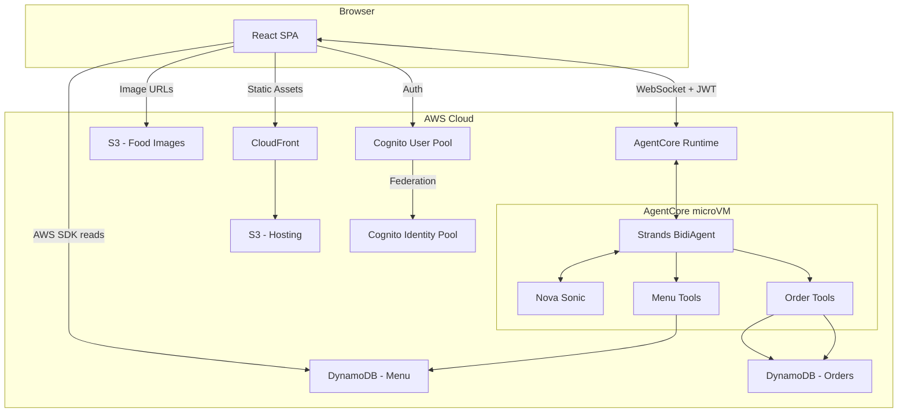
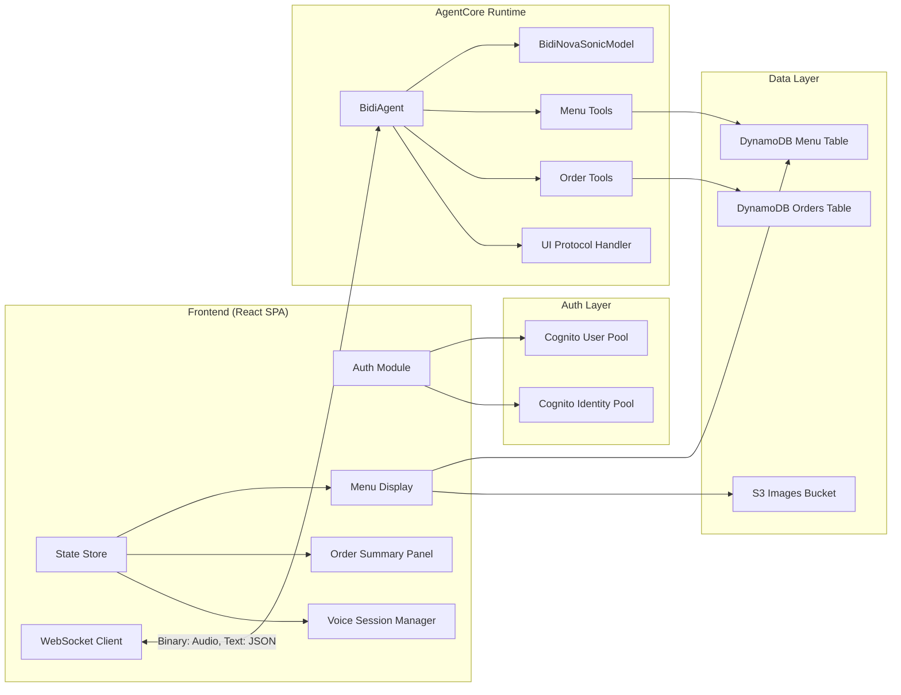
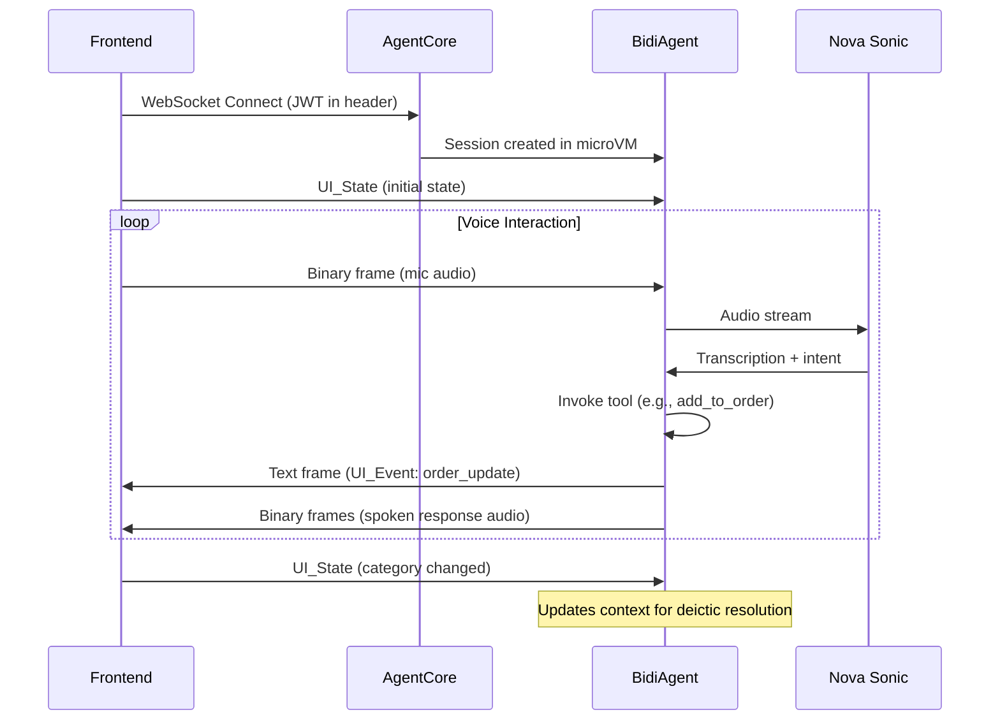

# Design Document: Drive-Thru Voice Ordering

## Overview

This design describes a drive-thru ordering application where customers place food orders using natural voice interaction powered by Amazon Nova Sonic via the Strands Agents SDK. The system is composed of two main parts:

1. A Vite + React static SPA frontend hosted on S3/CloudFront that displays a visual menu and manages voice sessions.
2. A Python Strands BidiAgent backend deployed on Amazon Bedrock AgentCore Runtime that handles real-time bidirectional voice streaming, menu browsing, and order management through custom tools.

Customers authenticate via Amazon Cognito, browse a visual menu, and initiate a voice session that connects directly to AgentCore Runtime over WebSocket. The agent interprets speech, invokes tools to query menu data and manage orders, and sends structured UI_Event messages back to the frontend to drive real-time visual updates. The frontend sends UI_State messages to the agent so it can resolve ambiguous voice references (e.g., "add this one") to the correct menu item.

All infrastructure is defined in Python CDK for reproducibility.



### Key Design Decisions

- **Direct browser-to-AgentCore WebSocket**: No API Gateway or Lambda proxy. The browser authenticates with a Cognito JWT and connects directly to the AgentCore Runtime WebSocket endpoint. This minimizes latency for real-time audio streaming.
- **Bidirectional UI protocol**: The agent sends UI_Events (JSON text frames) alongside audio (binary frames) over the same WebSocket. The frontend demultiplexes by frame type. The frontend sends UI_State messages so the agent has visual context for resolving deictic references.
- **Frontend reads menu data directly from DynamoDB**: Using Cognito identity pool credentials and the AWS SDK, the frontend reads menu data on load without going through the agent. This decouples menu display from voice session availability.
- **Agent tools for all mutations**: All order state changes go through Order_Tools on the agent side. The frontend never writes to the orders table directly.
- **Session isolation via AgentCore microVMs**: Each voice session runs in a dedicated microVM, providing natural session isolation for order state.

## Architecture

### System Components



### Frontend Architecture

The React SPA is organized around a central state store that is updated by two sources:
1. **DynamoDB reads** on initial load (menu data).
2. **Incoming UI_Events** from the agent over WebSocket during a voice session.

All visual components reactively render from this state store.

Key modules:
- **Auth Module**: Handles Cognito sign-in, token management, and identity pool credential retrieval. Uses `@aws-amplify/auth` or the Cognito SDK.
- **Menu Display**: Renders categorized menu items with images. Supports highlighting categories/items in response to UI_Events.
- **Voice Session Manager**: Manages microphone access (MediaStream API), WebSocket lifecycle, audio encoding/decoding, and the start/stop voice button.
- **Order Summary Panel**: Displays the running order (items, quantities, prices, total) updated via `order_update` UI_Events.
- **WebSocket Client**: Handles connection to AgentCore Runtime, demultiplexes binary (audio) and text (JSON) frames, dispatches UI_Events to the state store, and sends UI_State messages.
- **State Store**: A React context or lightweight state manager (e.g., Zustand) holding menu data, current order, active category, highlighted item, and voice session status.

### Agent Architecture

The Strands BidiAgent runs inside an AgentCore microVM with:
- **BidiNovaSonicModel**: Connects to Nova Sonic (`amazon.nova-sonic-v1:0`) for bidirectional audio streaming (speech-to-text and text-to-speech).
- **Menu Tools**: `get_categories`, `get_items_by_category`, `get_item_details`, `get_recommendations` — all read from DynamoDB menu table.
- **Order Tools**: `add_to_order`, `remove_from_order`, `get_order_summary`, `place_order`, `cancel_order` — manage in-memory order state and persist to DynamoDB on `place_order`.
- **UI Protocol Handler**: After each tool invocation, the agent constructs and sends the appropriate UI_Event JSON message over the WebSocket. It also receives and parses UI_State messages from the frontend to maintain awareness of the customer's visual context.

### WebSocket Message Protocol



**Frame types on the WebSocket**:
- **Binary frames**: Raw audio data (PCM or Opus) in both directions.
- **Text frames**: JSON messages — UI_Events from agent to frontend, UI_State from frontend to agent.

## Components and Interfaces

### Frontend Components

#### AuthProvider
```typescript
interface AuthProvider {
  signIn(username: string, password: string): Promise<AuthSession>;
  signOut(): Promise<void>;
  getJwtToken(): Promise<string>;
  getAwsCredentials(): Promise<AWSCredentials>;
  refreshToken(): Promise<string>;
  onTokenExpiry(callback: () => void): void;
}

interface AuthSession {
  jwtToken: string;
  refreshToken: string;
  userId: string;
  expiresAt: number;
}
```

#### MenuService
```typescript
interface MenuService {
  getCategories(): Promise<Category[]>;
  getItemsByCategory(categoryId: string): Promise<MenuItem[]>;
  getAllMenuItems(): Promise<MenuItem[]>;
}
```

#### VoiceSessionManager
```typescript
interface VoiceSessionManager {
  startSession(jwtToken: string): Promise<void>;
  endSession(): void;
  isActive(): boolean;
  onAudioReceived(callback: (audio: ArrayBuffer) => void): void;
  onUIEvent(callback: (event: UIEvent) => void): void;
  sendUIState(state: UIState): void;
}
```

#### WebSocketClient
```typescript
interface WebSocketClient {
  connect(endpoint: string, jwtToken: string): Promise<void>;
  disconnect(): void;
  sendAudio(data: ArrayBuffer): void;
  sendTextMessage(message: string): void;
  onBinaryMessage(callback: (data: ArrayBuffer) => void): void;
  onTextMessage(callback: (data: string) => void): void;
  onDisconnect(callback: (reason: string) => void): void;
  onReconnect(callback: () => void): void;
  getState(): WebSocketState;
}

type WebSocketState = 'connecting' | 'connected' | 'disconnected' | 'reconnecting';
```

#### StateStore
```typescript
interface AppState {
  menu: {
    categories: Category[];
    items: Record<string, MenuItem[]>;
    highlightedCategory: string | null;
    highlightedItem: string | null;
    loading: boolean;
    error: string | null;
  };
  order: {
    items: OrderItem[];
    total: number;
    confirmed: boolean;
    orderNumber: string | null;
  };
  voice: {
    sessionActive: boolean;
    listening: boolean;
    micPermission: 'granted' | 'denied' | 'prompt';
  };
  auth: {
    authenticated: boolean;
    userId: string | null;
  };
}
```

### UI Event / UI State Protocol

```typescript
// Agent -> Frontend
interface UIEvent {
  type: 'order_update' | 'highlight_category' | 'browse_category' | 'highlight_item' | 'order_confirmed';
  payload: OrderUpdatePayload | CategoryPayload | ItemPayload | OrderConfirmedPayload;
}

interface OrderUpdatePayload {
  items: OrderItem[];
  total: number;
}

interface CategoryPayload {
  categoryId: string;
  categoryName: string;
}

interface ItemPayload {
  itemId: string;
  itemName: string;
}

interface OrderConfirmedPayload {
  orderNumber: string;
  items: OrderItem[];
  total: number;
  timestamp: string;
}

// Frontend -> Agent
interface UIState {
  visibleCategory: string | null;
  selectedItem: string | null;
  orderItems: OrderItem[];
  orderTotal: number;
}
```

### Agent Tools (Python)

#### Menu Tools
```python
@tool
def get_categories() -> dict:
    """Returns all menu categories."""
    ...

@tool
def get_items_by_category(category_id: str) -> dict:
    """Returns all menu items in a given category with name, price, description."""
    ...

@tool
def get_item_details(item_id: str) -> dict:
    """Returns full details for a specific menu item including description and image URL."""
    ...

@tool
def get_recommendations() -> dict:
    """Returns a list of featured/popular menu items."""
    ...
```

#### Order Tools
```python
@tool
def add_to_order(item_id: str, quantity: int = 1) -> dict:
    """Adds a menu item to the current order. Returns updated order state."""
    ...

@tool
def remove_from_order(item_id: str, quantity: int = 1) -> dict:
    """Removes a menu item from the current order. Returns updated order state."""
    ...

@tool
def get_order_summary() -> dict:
    """Returns the current order summary with all items, quantities, and total."""
    ...

@tool
def place_order() -> dict:
    """Finalizes the order, persists to DynamoDB, returns order number."""
    ...

@tool
def cancel_order() -> dict:
    """Clears all items from the current order."""
    ...
```

### CDK Stack Interface
```python
class DriveThruVoiceOrderingStack(Stack):
    """Provisions all infrastructure for the drive-thru voice ordering system."""
    
    # Resources created:
    # - menu_table: DynamoDB Table (menu data)
    # - orders_table: DynamoDB Table (orders)
    # - images_bucket: S3 Bucket (food images)
    # - hosting_bucket: S3 Bucket (frontend static files)
    # - distribution: CloudFront Distribution (serves frontend + images)
    # - user_pool: Cognito UserPool
    # - identity_pool: Cognito IdentityPool
    # - agent_runtime: AgentCore Runtime endpoint
```

## Data Models

### Menu Item (DynamoDB Menu Table)

**Table name**: `DriveThruMenu`  
**Partition key**: `PK` (String) — `CATEGORY#<categoryId>`  
**Sort key**: `SK` (String) — `ITEM#<itemId>` or `METADATA`

| Attribute | Type | Description |
|-----------|------|-------------|
| PK | String | `CATEGORY#<categoryId>` |
| SK | String | `ITEM#<itemId>` for items, `METADATA` for category info |
| name | String | Display name of the item or category |
| description | String | Item description |
| price | Number | Price in cents (integer) to avoid floating-point issues |
| imageUrl | String | S3 key for the food image (resolved via CloudFront URL) |
| category | String | Category name (denormalized on items for convenience) |
| featured | Boolean | Whether the item appears in recommendations |
| sortOrder | Number | Display ordering within a category |

**Access patterns**:
- Get all categories: Query where `SK = METADATA` across all PKs (or use a GSI with `type=category`)
- Get items by category: Query `PK = CATEGORY#<categoryId>` where `SK begins_with ITEM#`
- Get item details: GetItem with `PK = CATEGORY#<categoryId>`, `SK = ITEM#<itemId>`
- Get recommendations: Query with filter `featured = true` (or use a GSI)

### Order (DynamoDB Orders Table)

**Table name**: `DriveThruOrders`  
**Partition key**: `orderId` (String) — UUID  

| Attribute | Type | Description |
|-----------|------|-------------|
| orderId | String | UUID, generated on place_order |
| userId | String | Cognito user sub |
| items | List | List of `{itemId, name, quantity, unitPrice}` maps |
| total | Number | Total price in cents |
| status | String | `confirmed` |
| createdAt | String | ISO 8601 timestamp |

### In-Memory Order State (Agent Session)

During a voice session, the agent maintains order state in memory within the microVM:

```python
@dataclass
class OrderState:
    items: dict[str, OrderLineItem]  # itemId -> line item
    
@dataclass
class OrderLineItem:
    item_id: str
    name: str
    quantity: int
    unit_price: int  # cents
```

This state is the source of truth during the session. It is persisted to DynamoDB only when `place_order` is invoked.

### TypeScript Data Types (Frontend)

```typescript
interface Category {
  categoryId: string;
  name: string;
  sortOrder: number;
}

interface MenuItem {
  itemId: string;
  categoryId: string;
  name: string;
  description: string;
  price: number; // cents
  imageUrl: string;
  category: string;
  featured: boolean;
  sortOrder: number;
}

interface OrderItem {
  itemId: string;
  name: string;
  quantity: number;
  unitPrice: number; // cents
}
```

## Correctness Properties

*A property is a characteristic or behavior that should hold true across all valid executions of a system — essentially, a formal statement about what the system should do. Properties serve as the bridge between human-readable specifications and machine-verifiable correctness guarantees.*

### Property 1: Menu data parsing produces complete MenuItems

*For any* valid DynamoDB item containing name, description, price, category, and imageUrl fields, parsing it through the menu service should produce a MenuItem object with all five fields present and matching the source values.

**Validates: Requirements 1.1, 5.3**

### Property 2: Menu item rendering includes all required information

*For any* MenuItem, the rendered component should contain the item's name, description, formatted price, and an image element with a valid src attribute.

**Validates: Requirements 1.2**

### Property 3: Category grouping correctness

*For any* list of MenuItems with various category values, grouping them by category should produce groups where every item in each group has the matching category, and the total count of items across all groups equals the original list length.

**Validates: Requirements 1.3**

### Property 4: Active voice session shows listening indicator

*For any* app state where `voice.sessionActive` is true, the UI should render a visible listening indicator element.

**Validates: Requirements 2.5**

### Property 5: add_to_order correctly updates order state

*For any* valid menu item ID, quantity (≥1), and existing order state, calling `add_to_order` should result in an order where the specified item's quantity has increased by the requested amount and the total price has increased by `quantity × unitPrice`.

**Validates: Requirements 3.2, 3.3**

### Property 6: remove_from_order correctly reduces order state

*For any* order containing at least one item, calling `remove_from_order` with that item's ID should result in the item's quantity being reduced (or the item being removed if quantity reaches zero), and the total price decreasing by `quantity × unitPrice`.

**Validates: Requirements 3.5**

### Property 7: cancel_order clears all items

*For any* order state (empty or non-empty), calling `cancel_order` should result in an order with zero items and a total of zero.

**Validates: Requirements 4.4**

### Property 8: UI_Event processing updates state store correctly

*For any* valid UI_Event (order_update, browse_category, highlight_item, highlight_category, order_confirmed), applying it to the state store should update exactly the corresponding state fields to match the event payload, leaving unrelated state fields unchanged.

**Validates: Requirements 4.1, 4.5, 8.4, 8.5**

### Property 9: place_order produces a complete order record

*For any* non-empty order state, calling `place_order` should produce an order record containing a non-empty order number (UUID), all item details matching the current order state, a total matching the sum of `quantity × unitPrice` for all items, a userId, and a valid ISO 8601 timestamp.

**Validates: Requirements 6.1, 6.3**

### Property 10: get_categories returns all distinct categories

*For any* menu table state containing items across N distinct categories, `get_categories` should return exactly N categories, and every category present in the table should appear in the result.

**Validates: Requirements 8.1**

### Property 11: get_items_by_category returns only matching items

*For any* category that exists in the menu table, `get_items_by_category` should return a non-empty list where every item has the requested category, and no items from other categories are included.

**Validates: Requirements 8.2**

### Property 12: get_item_details returns complete item data

*For any* item ID that exists in the menu table, `get_item_details` should return an object containing the item's name, description, price, and imageUrl, all matching the stored values.

**Validates: Requirements 8.3**

### Property 13: get_recommendations returns only featured items

*For any* menu table state, `get_recommendations` should return a list where every item has `featured = true`, and no non-featured items are included.

**Validates: Requirements 8.7**

### Property 14: Session end preserves order items

*For any* app state with an active voice session and items in the order, ending the session should set `voice.sessionActive` to false while keeping `order.items` and `order.total` unchanged.

**Validates: Requirements 9.4**

### Property 15: Protocol message serialization round-trip

*For any* valid UI_Event or UI_State object, serializing to JSON and deserializing back should produce an object equal to the original.

**Validates: Requirements 11.1, 11.9**

### Property 16: WebSocket message demultiplexing

*For any* incoming WebSocket message, if the message is a binary frame it should be routed to the audio handler, and if it is a text frame it should be parsed as JSON and routed to the UI_Event handler.

**Validates: Requirements 11.2**

### Property 17: Order tools emit order_update UI_Events

*For any* order tool invocation (add_to_order, remove_from_order, cancel_order, place_order), the result should include a UI_Event of type "order_update" containing the current order state with items, quantities, prices, and total.

**Validates: Requirements 11.3**

### Property 18: User interaction sends UI_State with current context

*For any* user interaction that changes the visual context (scrolling to a category or selecting an item), the frontend should send a UI_State message over the WebSocket containing the updated `visibleCategory` or `selectedItem` value.

**Validates: Requirements 11.11, 11.12**

## Error Handling

### Frontend Errors

| Error Scenario | Handling Strategy |
|---|---|
| DynamoDB menu table unreachable | Display error banner: "Menu unavailable. Please try again." Retry with exponential backoff (3 attempts). |
| S3 image load failure | Display placeholder image. Log error. Do not block menu rendering. |
| Microphone access denied | Show message explaining mic is required. Disable voice button. Allow visual-only browsing. |
| WebSocket connection failure | Show "Connecting..." indicator. Auto-reconnect within 5 seconds with exponential backoff (max 3 retries). |
| WebSocket disconnection mid-session | Attempt reconnect. If successful, send current UI_State. If failed after retries, show error and preserve order state. |
| JWT token expiry | Silently refresh using Cognito refresh token. If refresh fails, redirect to sign-in. |
| Authentication failure | Show error message on sign-in screen. Allow retry. |
| Invalid UI_Event JSON | Log warning. Ignore malformed event. Do not crash the UI. |
| Audio playback failure | Log error. Continue session — agent responses may be text-only fallback. |

### Agent Errors

| Error Scenario | Handling Strategy |
|---|---|
| Menu item not found in DynamoDB | Return structured error from tool. Agent speaks: "I couldn't find that item. Could you try again?" |
| DynamoDB write failure on place_order | Return error from tool. Agent speaks: "There was a problem placing your order. Let me try again." Retry once. |
| Invalid item_id in order tool | Return error with message. Agent asks customer to clarify. |
| Nova Sonic connection failure | Agent session fails to start. Frontend receives WebSocket close. Reconnect flow triggers. |
| Idle timeout (30s) | Agent sends spoken prompt: "Are you still there? Would you like to continue ordering?" |
| Idle timeout (60s after prompt) | Agent ends session. Sends close frame. Frontend preserves order, returns to browse state. |

### Data Validation

- All prices stored as integers (cents) to avoid floating-point arithmetic issues.
- Order totals computed server-side in the agent tools, not in the frontend.
- Item IDs validated against the menu table before adding to order.
- Quantity must be ≥ 1 for add_to_order and remove_from_order.
- UI_Event and UI_State messages validated against their JSON schemas before processing.

## Testing Strategy

### Unit Tests

Unit tests cover specific examples, edge cases, and error conditions:

- **Frontend**:
  - Auth flow: sign-in success, sign-in failure, token refresh
  - Menu loading: successful load, DynamoDB error, empty menu
  - WebSocket: connection, disconnection, reconnection within 5s
  - UI_Event handling: each event type updates correct state fields
  - UI_State sending: initial state on connect, category scroll, item tap
  - Order display: rendering with 0, 1, and many items
  - Microphone: permission granted, permission denied
  - Image loading: successful load, fallback to placeholder

- **Agent Tools**:
  - get_categories: returns categories from mock DynamoDB
  - get_items_by_category: valid category, non-existent category
  - get_item_details: valid item, non-existent item
  - get_recommendations: menu with featured items, menu with no featured items
  - add_to_order: new item, existing item (quantity increment), invalid item
  - remove_from_order: existing item, item not in order, reduce to zero removes item
  - place_order: non-empty order, empty order (should fail)
  - cancel_order: non-empty order, already empty order
  - UI_Event emission: each tool emits correct event type

- **CDK Stack**:
  - Snapshot tests for synthesized CloudFormation template
  - Verify resource counts and types

### Property-Based Tests

Property-based tests verify universal properties across randomly generated inputs. Each property test runs a minimum of 100 iterations.

**Frontend (TypeScript — using fast-check)**:

- **Feature: drive-thru-voice-ordering, Property 1: Menu data parsing produces complete MenuItems** — Generate random DynamoDB item shapes, verify parsing produces complete MenuItems.
- **Feature: drive-thru-voice-ordering, Property 2: Menu item rendering includes all required information** — Generate random MenuItems, verify rendered output contains all fields.
- **Feature: drive-thru-voice-ordering, Property 3: Category grouping correctness** — Generate random lists of MenuItems with various categories, verify grouping invariants.
- **Feature: drive-thru-voice-ordering, Property 4: Active voice session shows listening indicator** — Generate random app states with sessionActive=true, verify indicator renders.
- **Feature: drive-thru-voice-ordering, Property 8: UI_Event processing updates state store correctly** — Generate random UI_Events of all types, verify state store updates match payloads.
- **Feature: drive-thru-voice-ordering, Property 14: Session end preserves order items** — Generate random app states with active sessions and orders, verify order preserved after session end.
- **Feature: drive-thru-voice-ordering, Property 15: Protocol message serialization round-trip** — Generate random UI_Event and UI_State objects, verify JSON round-trip equality.
- **Feature: drive-thru-voice-ordering, Property 16: WebSocket message demultiplexing** — Generate random binary and text frames, verify correct routing.
- **Feature: drive-thru-voice-ordering, Property 18: User interaction sends UI_State with current context** — Generate random category/item selections, verify UI_State messages contain correct values.

**Agent Tools (Python — using Hypothesis)**:

- **Feature: drive-thru-voice-ordering, Property 5: add_to_order correctly updates order state** — Generate random item IDs, quantities, and order states, verify order math.
- **Feature: drive-thru-voice-ordering, Property 6: remove_from_order correctly reduces order state** — Generate random orders with items, verify removal math.
- **Feature: drive-thru-voice-ordering, Property 7: cancel_order clears all items** — Generate random order states, verify cancel produces empty order.
- **Feature: drive-thru-voice-ordering, Property 9: place_order produces a complete order record** — Generate random non-empty orders, verify output record completeness.
- **Feature: drive-thru-voice-ordering, Property 10: get_categories returns all distinct categories** — Generate random menu table data, verify category completeness.
- **Feature: drive-thru-voice-ordering, Property 11: get_items_by_category returns only matching items** — Generate random menu data and category queries, verify filtering.
- **Feature: drive-thru-voice-ordering, Property 12: get_item_details returns complete item data** — Generate random menu items, verify detail retrieval completeness.
- **Feature: drive-thru-voice-ordering, Property 13: get_recommendations returns only featured items** — Generate random menu data with mixed featured flags, verify filtering.
- **Feature: drive-thru-voice-ordering, Property 17: Order tools emit order_update UI_Events** — Generate random order tool invocations, verify UI_Event emission.

### Test Libraries

| Layer | Language | Unit Test Framework | Property-Based Testing Library |
|-------|----------|-------------------|-------------------------------|
| Frontend | TypeScript | Vitest + React Testing Library | fast-check |
| Agent Tools | Python | pytest | Hypothesis |
| CDK Stack | Python | pytest | N/A (snapshot tests) |

### Test Configuration

- Property-based tests: minimum 100 iterations per property
- Each property test tagged with: `Feature: drive-thru-voice-ordering, Property {N}: {title}`
- Frontend tests use jsdom environment
- Agent tool tests use mocked DynamoDB (moto or manual mocks)
- CI runs all tests on every push
