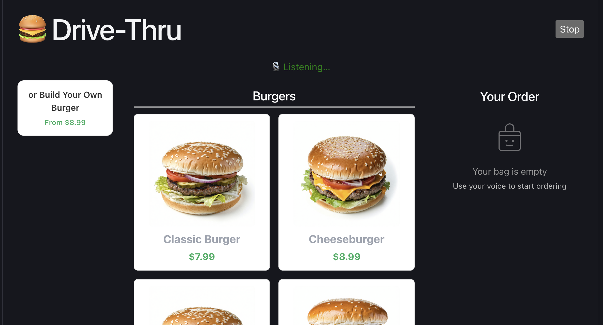
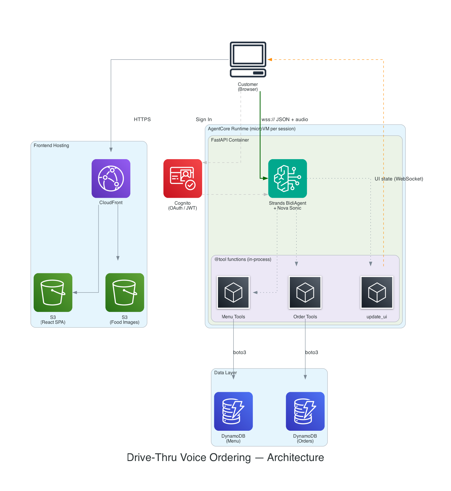

# Drive-Thru Voice Ordering

A voice-powered drive-thru ordering app built with Amazon Nova Sonic, Strands Agents SDK, and React. Customers talk to an AI attendant who takes their order, browses the menu, and manages the entire UI — all through natural conversation.



## Demo

<video src="demo.mp4" controls width="100%"></video>

## Architecture



**Key design decisions:**
- **Agent controls the UI** — the agent has a single `update_ui` tool that sets the entire frontend display state. The frontend just renders what it receives.
- **No direct AWS calls from browser** — the frontend doesn't talk to DynamoDB or S3 directly. All data flows through the agent via WebSocket.
- **JSON protocol** — all WebSocket communication is JSON (audio is base64-encoded). Strands BidiAgent handles routing natively.
- **OAuth auth** — Cognito JWT token via `Sec-WebSocket-Protocol` header for WebSocket authentication.

## Prerequisites

- Node.js 18+
- Python 3.11+
- Docker (for building the agent container)
- AWS CLI configured with credentials
- AWS CDK CLI (`npm install -g aws-cdk`)
- Amazon Bedrock Nova Sonic access in us-east-1

## Project Structure

```
agent/            – Strands BidiAgent (FastAPI + Nova Sonic, containerized)
frontend/         – React SPA (Vite + TypeScript)
cdk/              – Two CDK stacks (BackendStack + FrontendStack)
data/             – Menu data (JSON) and food images
deploy.sh         – One-command deploy
generate_config.py – Generates frontend config from CDK outputs
```

## Deploy

### One command

```bash
./deploy.sh
```

This runs four steps:
1. Deploys BackendStack (DynamoDB, S3, CloudFront, Cognito, AgentCore Runtime, seeds menu data + images)
2. Generates `frontend/public/runtime-config.json` from backend outputs
3. Builds the frontend
4. Deploys FrontendStack (uploads to S3, invalidates CloudFront)

### Step by step

```bash
# 1. Deploy backend
cd cdk
python -m venv .venv && source .venv/bin/activate
pip install -r requirements.txt
cdk bootstrap    # first time only
cdk deploy BackendStack --outputs-file backend-outputs.json

# 2. Generate frontend config
cd ..
python generate_config.py

# 3. Build frontend
cd frontend && npm ci && npm run build && cd ..

# 4. Deploy frontend
cd cdk
BUCKET=$(python3 -c "import json; print(json.load(open('backend-outputs.json'))['BackendStack']['HostingBucketName'])")
DIST=$(python3 -c "import json; print(json.load(open('backend-outputs.json'))['BackendStack']['DistributionId'])")
cdk deploy FrontendStack --context hostingBucketName="$BUCKET" --context distributionId="$DIST"
```

## Create a Cognito User

```bash
aws cognito-idp admin-create-user \
  --user-pool-id <UserPoolId> \
  --username your@email.com \
  --temporary-password TempPass123! \
  --user-attributes Name=email,Value=your@email.com Name=email_verified,Value=true

aws cognito-idp admin-set-user-password \
  --user-pool-id <UserPoolId> \
  --username your@email.com \
  --password YourPassword123! \
  --permanent
```

## How It Works

1. **Sign in** → Cognito Authenticator handles sign-in, sign-up, password reset
2. **Start Your Order** → big centered button, connects WebSocket to AgentCore
3. **Agent loads menu** → calls `load_menu` tool, sends full menu to frontend via `update_ui`
4. **Voice conversation** → bidirectional audio streaming with Nova Sonic
5. **Agent controls the screen** → highlights categories, shows item details, updates order panel
6. **Build Your Own Burger** → interactive burger builder modal with real-time visual assembly
7. **Place order** → agent persists to DynamoDB, shows confirmation

## Sample Menu

Seeded automatically on deploy from `data/menu_items.json`:

| Category | Items |
|----------|-------|
| Build Your Own | Build Your Own Burger (custom patty + toppings) |
| Burgers  | Classic Burger, Cheeseburger, Double Burger, Veggie Burger |
| Chicken  | Crispy Chicken Sandwich, Spicy Chicken, Nuggets 6pc/10pc |
| Sides    | French Fries, Onion Rings, Mozzarella Sticks, Side Salad |
| Drinks   | Cola, Lemonade, Iced Tea, Chocolate/Vanilla Milkshake |
| Desserts | Apple Pie, Hot Fudge Sundae, Chocolate Chip Cookie |

Edit `data/menu_items.json` and redeploy to update.

## Local Development

```bash
cd frontend
npm install
npm run dev
```

Create `frontend/public/runtime-config.json` with your deployed resource IDs for local dev.

## Agent Tools

| Tool | Purpose |
|------|---------|
| `load_menu` | Loads full menu from DynamoDB, sends to frontend |
| `get_categories` | Returns menu categories |
| `get_items_by_category` | Returns items in a category |
| `get_recommendations` | Returns featured items |
| `add_to_order` | Adds item with optional special instructions |
| `build_custom_burger` | Builds a custom burger with chosen patty, toppings, and sauces |
| `remove_from_order` | Removes item from order |
| `get_order_summary` | Returns current order |
| `place_order` | Persists order to DynamoDB |
| `cancel_order` | Clears the order |
| `update_ui` | Sets the frontend display state (highlights, order, burger builder) |
| `get_ui_context` | Returns what the customer is looking at |

## Redeploying

```bash
./deploy.sh
```

## Security

See [CONTRIBUTING](CONTRIBUTING.md#security-issue-notifications) for more information.

## License

This library is licensed under the MIT-0 License. See the LICENSE file.
## Arrival updates ("5 minutes away" / "I'm here")

After an order is placed, the ordering app (`crazy-frontend/index.html`) shows two buttons, **I'm 5 minutes away** and **I'm here**. Each tap is stored on the order and appears on the kitchen display in the console, with a sound.

Customers can also choose to share their phone's location. The app then works out the distance to the restaurant and a rough driving time by itself (straight-line distance × 1.3 at 30 km/h; no maps service or API key) and sends "on the way", "5 minutes away" and "I'm here" automatically. This needs the restaurant's coordinates: **Console → Settings → Business and tax → Restaurant latitude / longitude**. Until they are entered, only the buttons are shown.

The routes are in `agent/arrival.py` (`GET /orders/{id}/track`, `POST /orders/{id}/arrival`). They are public, so every order gets a private tracking key when it is placed. If the ordering app is served from a different domain than the console, add that domain to the `ADMIN_ORIGINS` environment variable.

## Operations: stock alerts, production and waste, POS sales

The merchant console (`crazy-frontend/console.html`, API in `agent/ops.py`) adds:

- **Stock alerts at 20–30%.** Give each stock item a *par level* (how much you want on the shelf). When it falls to the alert level (25% by default, change it on the Inventory page) it is flagged *low*; below the critical level it is *critical*; at zero, *out*. Each crossing opens an alert, shown with a badge on Inventory until someone taps "Got it", and closes itself when the item is refilled. Items marked *perishable* (milk, bread, fresh meat) are always on **Today's purchase list**, topped up to par, which can be turned into a purchase order in one tap.
- **Production and waste.** The kitchen logs what it prepared (biryani, cutlets, snacks) and anything thrown away (unsold, dropped, broken). The daily report compares *made* with *sold* (voice orders + POS) and *wasted*, and shows the money lost: wasted portions, portions made but neither sold nor logged ("missing"), and stock-count gaps.
- **POS sales.** A POS posts each day's item sales to `POST /admin/api/ops/pos/sales` with the header `X-POS-Key` (set the key under Production and waste → Import POS sales). Body: `{"day": "2026-10-10", "ref": "Z-1042", "sales": [{"itemId": "chicken-biryani", "qty": 28, "amount": 50400}]}` (amount in fils; `name` can be sent instead of `itemId`). Managers can also paste sales in by hand.

## Loyalty and rewards (mobile number + 4-digit PIN)

Customers join from the **More** tab of the ordering app with their mobile number and a 4-digit PIN; no email. PINs are stored hashed, five wrong PINs lock the account for 15 minutes, and obvious PINs (1234, 0000…) are refused. Members earn points when an order linked to them is marked *completed* (1 point per AED 1 by default; 1 point = AED 0.05). Orders placed by voice while signed in are linked automatically.

Each member has a referral code and a share link (`?ref=CODE`). A friend who joins with it gets welcome points; the member gets a referral reward after that friend's first completed order. Cashiers redeem points at the window from **Loyalty and rewards → Redeem at the window**. All rates are set under **Programme settings**. Customer API: `agent/rewards.py` (`/rewards/join`, `/rewards/login`, `/rewards/me`, `/rewards/claim`).

## Voice conversation length

| Variable | Default | Effect |
|---|---|---|
| `VOICE_PRICE_MODE` | `checkout` | No prices while the customer is choosing; the total is said only at the order summary. Set to `always` to also say each item price and the running total. |
| `VOICE_REPLY_SENTENCES` | `1` | Longest reply the attendant gives (1–3 short sentences). |
